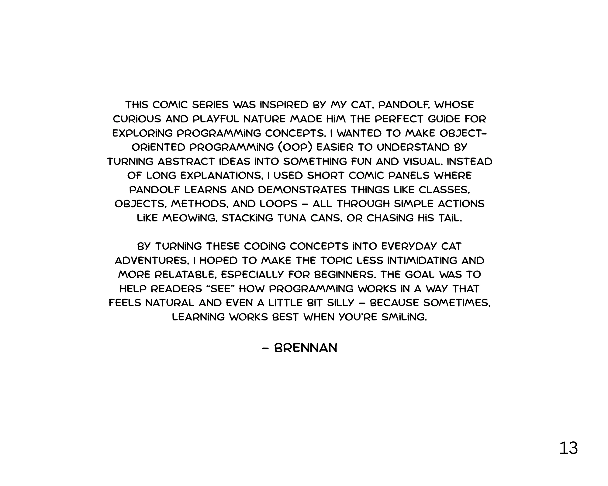

Welcome to a special visual edition of *Learning from Scratch()* featuring none other than **Pandolf**—our curious coding kitty!

In this comic series, we explore the **foundations of Object-Oriented Programming (OOP)** through the eyes of Pandolf as he embarks on a paws-itively fun learning journey. Whether you're a beginner trying to grasp the basics or a more seasoned coder looking for a charming refresher, these comics break down programming concepts into bite-sized, illustrated ideas.

---

## Issue #1: Classes and Objects

OOP begins with the concept of **classes** and **objects**. Think of a class as a blueprint and objects as the real-world things built from that blueprint.

---

## Issue #2: Constructor, Method, Field, Property

Next, Pandolf learns what makes an object tick. Constructors help build it, fields store data, properties offer access, and methods let it act.

---

## Issue #3: Control Flow — Sequence, Selection & Repetition

In this issue, Pandolf discovers how programs make decisions and repeat tasks using **sequence**, **selection**, and **loops**—the true logic behind the magic.

---

## 📚 Why a Comic?

Teaching OOP to beginners can be tricky. Visual storytelling makes abstract concepts concrete. With Pandolf's help, learning becomes both **memorable and engaging**.

---

Thanks for following Pandolf's adventures! Stay tuned for the next issue where we’ll dig deeper into **inheritance**, **encapsulation**, and more!

If you’ve enjoyed these comics, share them with fellow learners or leave a comment below — we’d love to hear what you think!

